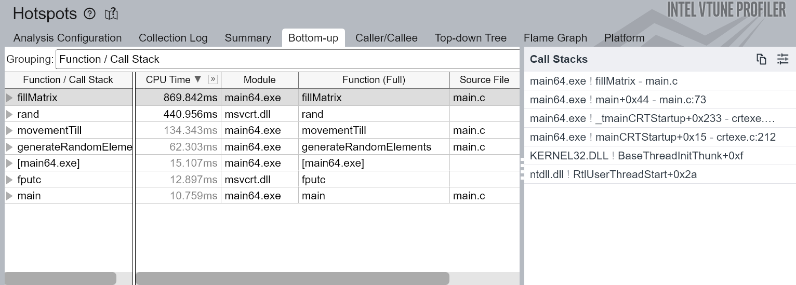
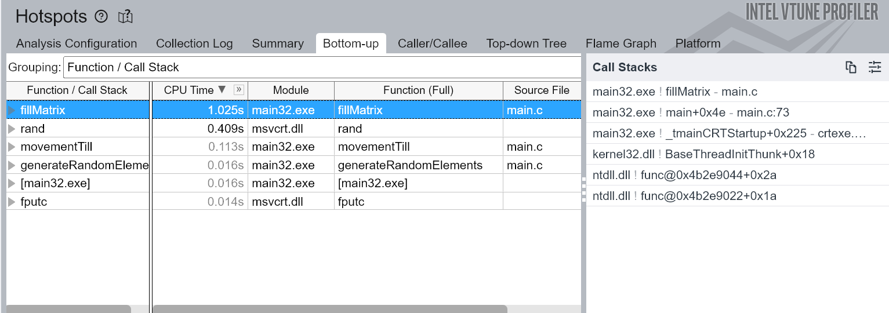

## Testing environment
For testing, we use a laptop with a 11th Gen i3-1115G4 with (2 cores, 4 threads) running Ubuntu 22.04.3 LTS inside WSL2.

## Week 3 - Profiling of serial implementation in C

After changing the code from C++ to C, we observed a significant speed improvement. 

If we run `gcc main.c -o main` on the updated source code we have the following runtime output
```
Number of tests: 500000
Number of successes: 255754
Probability of ship reaching the end: 51.15%
Program duration: 1.498695 seconds
```

If we use the compiler optimization flags such as O2 or O3 we will see even better execution time.
- O0: Reduce compilation time and make debugging produce the expected results. This is the default.
- O1: Optimize. Optimizing compilation takes somewhat more time, and a lot more memory for a large function.
- O2: Optimize even more. GCC performs nearly all supported optimizations that do not involve a space-speed tradeoff.
- O3: Optimize yet more.


`gcc main.c -o main -O3`
```
Number of tests: 500000
Number of successes: 256370
Probability of ship reaching the end: 51.27%
Program duration: 0.441351 seconds
```

Now it is obvious that the range of tests is already huge and we have to improve the potency of this simulation to achieve interesting results further when introducing the multithreading.

Inside Windows Subsytem for Linux we can use `sudo apt-get install mingw-w64` to install a cross compiler and run Intel V-Tune on Windows to check out Hotspots analysis for time spent on each line of source code. We compile `main32.exe` and `main64.exe` using commands `i686-w64-mingw32-gcc -o main32.exe main.c -g` and `x86_64-w64-mingw32-gcc -o main64.exe main.c -g`.

What we found out is CPU architecture matters in a due manner when working with arrays that take space in memory.

 

In conclusion, we need to remodel this simulation into a high speed computing process for next week. 