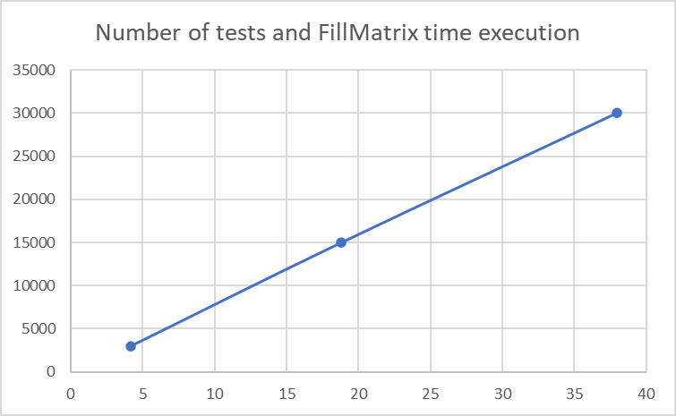
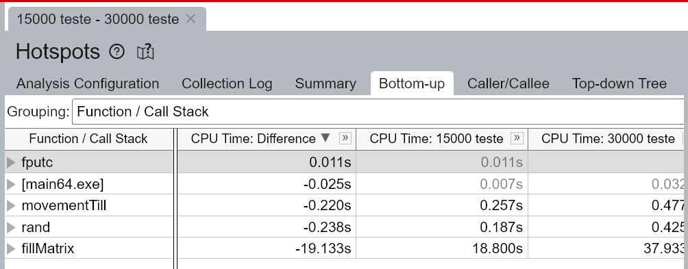
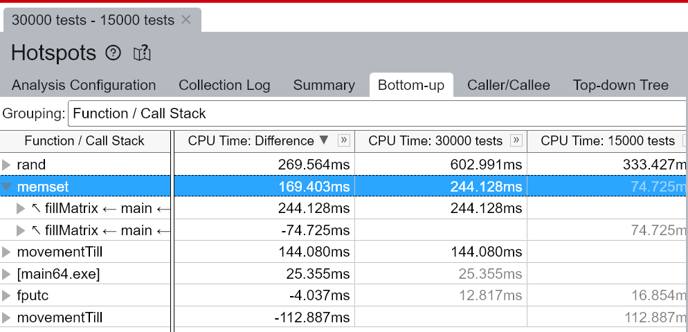
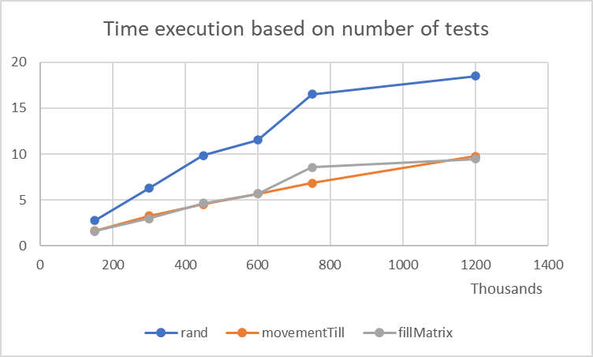
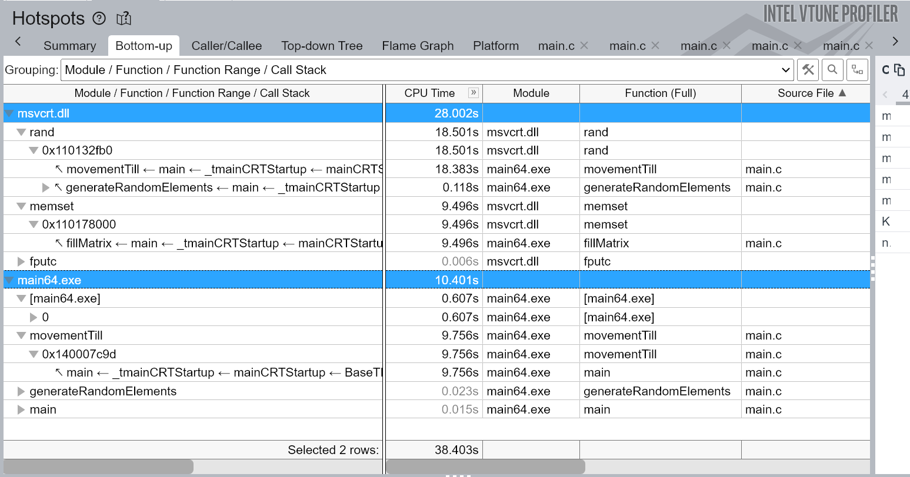
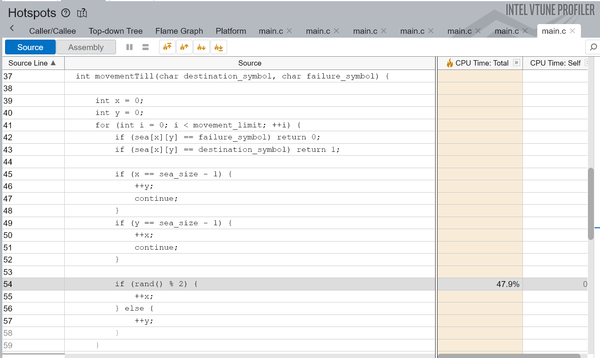
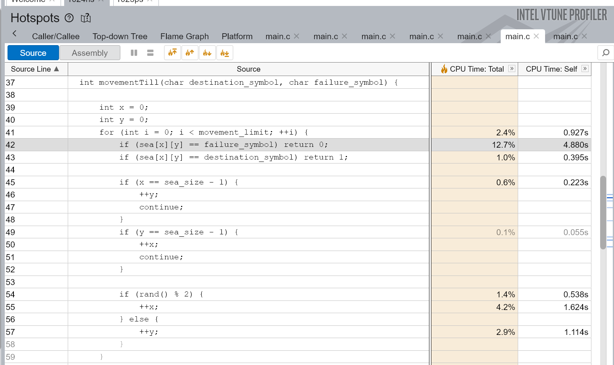

## Testing environment
For testing, we use a laptop with a 11th Gen i3-1115G4 with (2 cores, 4 threads) running Ubuntu 22.04.3 LTS inside WSL2.

## Week 4 - Advanced profiling of serial implementation in C

In this week we analyzed the consequences of constant values of the simulation in runtime speed. First of all, we had to increase the sea_size from 30x30 size to 800x800 size. Starting up with the number of tests, we see that only FillMatrix method is affected in execution time by increasing the number of tests. We used the default O0 optiimization flag and the x64 architecture because it's more stable.

### And finally, we see that 03 optimization flag improves execution time by using memset inside the FillMatrix making the program capable of very high test size range.

### We will go further and work on high number of tests. We will see what execution time consumers will appear.

### The figure shows largely a linear increase in time based on the tests size. What we could observe in Bottom-up Hotspoting by Call Stacks is that msvcrt.dll is doing a lot of CPU Time for rand and memset which coresspond to movementTill and fillMatrix methods. The main program is doing a lot of CPU Time only for movementTill. We attach the observations in movementTill for the dll execution and the optimized executable.

