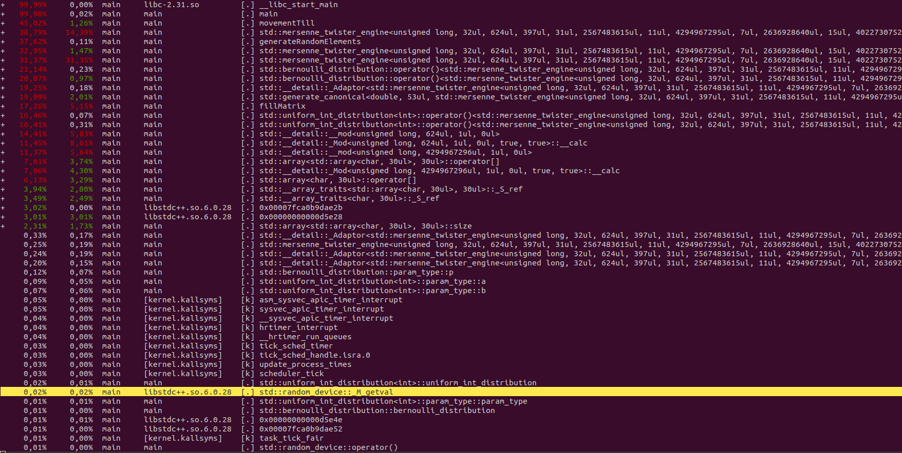
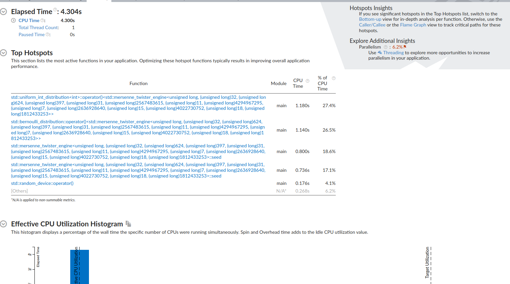
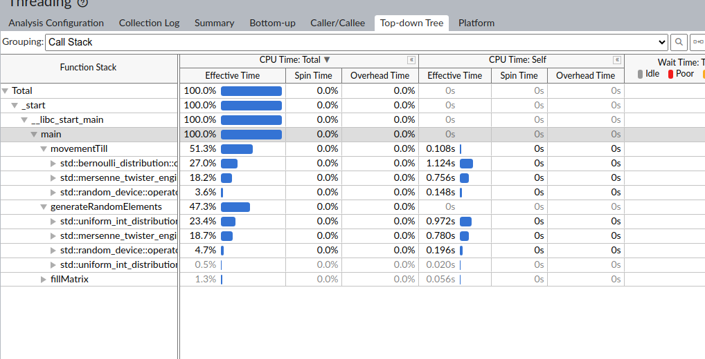

## Week 1 - Profiling of serial implementation

1. Serial Implementation - sligthly modified the original code
2. Measuring execution time of serial implementation 

> Program duration: 11.091308 seconds

3. Profiling of serial implementation using `perf`


As it's seen above, the movementTill, generateRandomElements and fillMatrix take the most amount of time. They call resource-heavy functions for random generation and would clearly benefit from code parallelization.

4. Optimized compiling and Intel VTune profiling

First, we ran optimized compiling using the -O2 Flag:

```
g++ -O2 -g -o main main.cpp
```

After this simple optimization option, the execution duration fell to ~4.3 seconds.

Then, we ran the Hotspot profiling for the program using Intel VTune:


The effective utilization is at 6.2%, with only one CPU being used. The main time is spent on random generation functions, as shown below:


